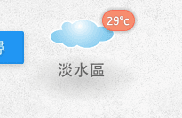
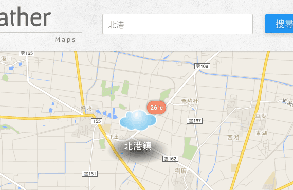
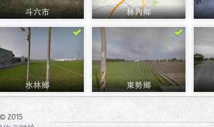

# Welcome to OA's Weather Maps!

想查詢每個地方的天氣嗎！藉由 **Google Maps API** 的地圖服務，以及**中央氣象局**網站的天氣預報，讓你快速輕鬆的查詢台灣 368 個鄉鎮的天氣概況！

---

 
## 聲明
* 本作品授權採用 姓名標示-非商業性 2.0 台灣 (CC BY-NC 2.0 TW) 授權，詳見 [http://creativecommons.org/licenses/by-nc/2.0/tw/](http://creativecommons.org/licenses/by-nc/2.0/tw/) 
* 網頁內容資料主要參考[中央氣象局](http://www.cwb.gov.tw/V7/index.htm)網站所公佈之內容建置，其內容預報僅供參考，更多詳細氣像概況可至[中央氣象局](http://www.cwb.gov.tw/V7/index.htm)查詢！

 
## 簡介
* 藉由 [Google Maps JavaScript API v3](https://developers.google.com/maps/documentation/javascript/) 的地圖服務，以及[中央氣象局](http://www.cwb.gov.tw/V7/index.htm)網站的天氣預報所實作的天氣地圖！
* 基本上是利用 Google Maps API 的 [Maps](https://developers.google.com/maps/documentation/javascript/tutorial) 以及 [Marker](https://developers.google.com/maps/documentation/javascript/markers) 設計！
* 附加使用 [MarkerWithLabel](http://google-maps-utility-library-v3.googlecode.com/svn/tags/markerwithlabel/1.1.8/docs/examples.html) 加強 Google Maps 上的圖像表現。
* 參考中央氣象局[手機版本網頁](http://www.cwb.gov.tw/m/)所提供的資料建置。
* 全網站使用[響應式網站設計(RWD)](http://www.ibest.tw/page01.php)，所以手機也可以正常瀏覽。
* 網站內容使用 [navigator.geolocation](https://developer.mozilla.org/zh-TW/docs/Using_geolocation) 物件取得前端 GPS 位置。
* 搭配 [localStorage](https://developer.mozilla.org/en-US/docs/Web/API/Window/localStorage) 實作[追蹤天氣](http://comdan66.github.io/weather/index.html)、[已讀](http://comdan66.github.io/weather/town.html#1)、[記錄上次地圖位置](http://comdan66.github.io/weather/maps.html).. 等功能。
* [搜尋功能](http://comdan66.github.io/weather/search.html)則使用 [Google Maps Geocoding API](https://developers.google.com/maps/documentation/geocoding/intro) 將住址搜尋更加準確化。
* 使用 [Static Maps API](https://developers.google.com/maps/documentation/staticmaps/intro) 以及 [Street View Image API](https://developers.google.com/maps/documentation/streetview/intro) 所提供的服務，擷取地點的地圖、街景截圖。
* 感謝 [宙思設計](http://zeusdesign.com.tw/) 提供的可愛天氣小圖示。
* 前端開發工具主要使用 [Gulp](http://gulpjs.com/)、[Compass](http://compass-style.org/) 以及 [jQuery](https://jquery.com/) 語言所建立，主要架構則使用 [OAF2E v1.2](https://github.com/comdan66/oaf2e/)。
* 後端語言為 [PHP](http://php.net/)，使用的 Framework 為 [OACI version 2.3](https://github.com/comdan66/oaci)。
* Demo 範例頁面: [http://comdan66.github.io/weather/index.html](http://comdan66.github.io/weather/index.html)

 
## 功能

* 追蹤關注各地天氣概況  
		
* 取得本地位置的天氣概況  
  

* 搜尋各鄉鎮的位置及天氣  
  
	
* 地圖、街景模式切換  
  

* 天氣變化長條圖  
  

* 記錄已讀過的鄉鎮資訊  
  

 
## 關於
* 作者名稱 - [OA Wu](http://www.ioa.tw/)

* E-mail - <comdan66@gmail.com>

* 作品名稱 - [Weather Maps](http://comdan66.github.io/weather/index.html)

* 最新版本 - 2.1.0

* GitHub - [Weather Maps](https://github.com/comdan66/weather)

* 相關資源 - [Google Maps JavaScript API v3](https://developers.google.com/maps/documentation/javascript/)

* 相關資源 - [MarkerWithLabel](http://google-maps-utility-library-v3.googlecode.com/svn/tags/markerwithlabel/1.1.8/docs/examples.html)

* 相關資源 - [中央氣象局](http://www.cwb.gov.tw/V7/index.htm)

* 更新日期 - 2015/07/29