# Welcome to OA's CodeIgniter!

This is OA's framework, It is based on CodeIgniter version 2.1.4!

---
## 聲明
本作品授權採用 姓名標示-非商業性 2.0 台灣 (CC BY-NC 2.0 TW) 授權，詳見 [http://creativecommons.org/licenses/by-nc/2.0/tw/](http://creativecommons.org/licenses/by-nc/2.0/tw/) 

<br />
## 目錄
* [簡介](#簡介)

* [快速初始化](#快速初始化)

* [常用指令](#常用指令)
	* [create controller](#create-controller)
	* [create migration](#create-migration)
	* [create model](#create-model)
	* [create cell](#create-cell)
	* [delete controller](#delete-controller)
	* [delete model](#delete-model)
	* [delete cell](#delete-cell)
	* [migration](#migration)
	* [clean cache](#clean-cache)
	
* [初始化指令](#初始化指令)

* [Demo指令](#demo指令)
	* [create demo](#create-demo)
	* [delete demo](#delete-demo)
	
* [Gulp](#gulp)

* [Compass](#compass)

<br />
<br />
## 簡介
這是一個以 CodeIgniter 2.1.4 為基礎版本，將其新增進階功能的一套好用的 framework!  

基本改寫項目如下:

* 匯入並且使用 [PHP ActiveRecord](http://www.phpactiverecord.org/) ORM。
	* 可以與 OrmUploader 搭配結合。

* 匯入使用 [Redis](http://redis.io/) cache library。

* <a name="back1"></a>匯入使用 OrmUploader 的 library。([註1](#comment1))
	* 可搭配 model 使用 ImageUplader、FileUploader 處理上傳表單。
	* ImageUplader 可配合使用 ImageGdUtility、ImageImagickUtility 處理圖片的 library。

* <a name="back2"></a>匯入使用 cell 的 library。([註2](#comment2))
	* 加強有層級結構關係。
	* 加強暫存快娶機制。
	* 導入可使用 [Redis](http://redis.io/) cache。
	
* Identity library 與 identity helper 的使用。
	* 方便管理權限問題。
	* Session 處理機制。

* Config 的 library 與應用。
	* 加強 CodeIgniter 原生 config 機制。

* Cache file folder 的重新定義。
	* 向下延伸 cache 分類資料夾。

* Controller core loading 規則順序的改變。
	* 運用 OOP 基本繼承概念定義主要 controller。

* 匯入 OA helper 的功能 function。

* 匯入 可記錄 delay request 的 log 以及 query log。

* 匯入並且可使用 scss。

* 匯入並且可使用 compass, gulp.. 等。


<br />
<br />
## 快速初始化
基本快速地建立起常用資料夾以及檔案，例如 log files、temp folders... 等。

* 請先確保您的 server 可以正常使用 CodeIgniter。

* <a name="back3"></a>打開終端機，並且在你的 DocumentRoot([註3](#comment3)) 下，輸入 ```git clone https://github.com/comdan66/oaci.git```。

* 進入資料夾，並且下初始指令，終端機輸入 ```php init db_user db_password db_name```，即完成。  
(參數 **db_user**、**db_password**、**db_name** 分別代表資料庫的 **使用者名稱**、**密碼**、**資料庫名稱**。)

* 更多初始化指令可以 [點我](#初始化指令)。

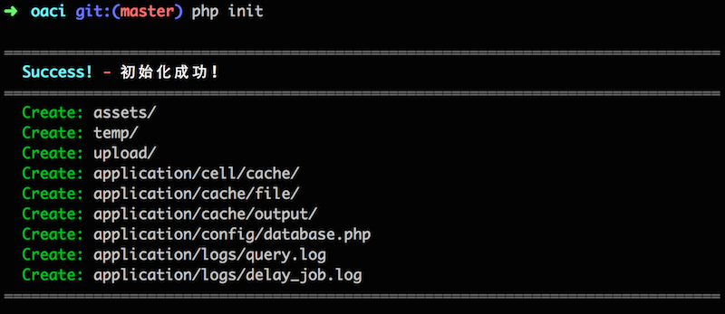

<br />
<br />
## 常用指令
此版本中已經建立多個快速建置檔案的指令，其中包含如下:

* create
	* [controller](#create-controller)
	* [migration](#create-migration)
	* [model](#create-model)
	* [cell](#create-cell)
	
* delete
	* [controller](#delete-controller)
	* [model](#delete-model)
	* [cell](#delete-cell)

* [migration](#migration)

* clean
	* [cache](#clean-cache)

* 語法表格
	* 新增 - create

		_  |  file  |    type    |      name       |       action
-----|--------|------------|-----------------|----------------
php  | create | controller | controller_name | [site \| admin \| delay]
php  | create | model      | model_name      | [[(-p | -pic) column_name1, column_name2...] | [(-f | -file) column_name1, column_name2...]]
php  | create | migration  | table_name      | [(-a \| -add) \| (-e \| -edit) \| (-d \| -delete \| -del \| -drop)]
php  | create | cell       | cell_name       | [method_name1, method_name2...]

	* 刪除 - delete

		_  |  file  |    type    |      name       |       action
-----|--------|------------|-----------------|----------------
php  | delete | controller | controller_name | [site \| admin \| delay]
php  | delete | model      | model_name      |
php  | delete | cell       | cell_name       |

	* migration

		_  |   file    |  version
-----|-----------|--------------------
php  | migration | [0 \| 1 \| 2 \|...]


	* 清除 - clean

	  _  |  file  |    type   |      name       
-----|--------|-----------|-----------------------------------
php  | clean  |   cache   | [cell \| file \| model \| [assets \| static]]

#### create controller
基本指令為 ```php create controller controller_name [site | admin | delay]```。

* controller_name 為欲建立的 controller 名稱。
* [site | admin | delay] 為 controller 形態，主要為這三種，其意思分別為 前台、後台、延遲，分別是繼承不同的 controller，**預設值為 site**。
* 舉例，若要建立一個名為 test 的前台 controller，則輸入 ```php create controller test site```。

[回常用指令 ↩](#常用指令)

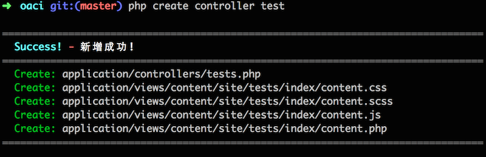

#### create migration
基本指令為 ```php create migration table_name [(-a | -add) | (-e | -edit) | (-d | -delete | -del | -drop)]```。

* table_name 為要修改的資料表名稱。
* [(-a | -add) | (-e | -edit) | (-d | -delete | -del | -drop)] 為此修改的主要動作行為，**預設值為 add**。
* 舉例，若要新增一個資料表，名稱為 test，則輸入 ```php create migration test add```，若要是想對 test 這張資料表做修改，則輸入 ```php create migration test edit```，刪除則是 ```php create migration test del```。

[回常用指令 ↩](#常用指令)

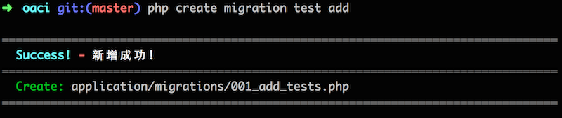

#### create model
基本指令為 ```[[(-p | -pic) column_name1, column_name2...] | [(-f | -file) column_name1, column_name2...]]```。

* model_name 為欲建立的 model 名稱。
* [(-p | -pic) column_name1, column_name2...] 為該 model 使用 **OrmImageUploader** 的欄位名稱，**可同時為多個**，**預設值為 null，也就是沒有欄位使用**。
* [(-f | -file) column_name1, column_name2...] 為該 model 使用 **OrmFileUploader** 的欄位名稱，**可同時為多個**，**預設值為 null，也就是沒有欄位使用**。
* 舉例，若要建立一個名為 test 的 model，則輸入 ```php create model test```，若 test 有兩個圖片欄位名稱分別為 avatar、cover，則是輸入 ```php create model test -p avatar cover```。

[回常用指令 ↩](#常用指令)

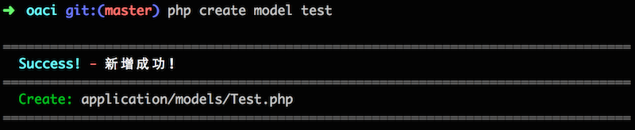

#### create cell
基本指令為 ```php create cell cell_name [method_name1, method_name2...]```。

* cell_name 為欲建立的 cell 名稱。
* [method_name1, method_name2...] 一併新增的 method 名稱，**可同時為多個**，**預設值為 null，也就是預設不新增任何 mothod**。
* 舉例，若要建立一個名為 test 的 cell，則輸入 ```php create cell test```，若是想一開始就建立名稱為 index 以及 add 的 method，則輸入 ```php create cell test index add```。
* 特別注意！ 預設的 cache 機制是被隱藏關閉的，如要使用再將註解拿掉即可。

[回常用指令 ↩](#常用指令)

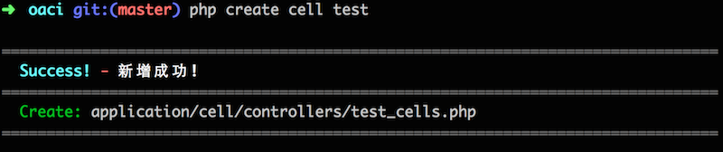

#### delete controller
基本指令為 ```php delete controller controller_name [site | admin | delay]```。

* controller_name 為欲刪除的 controller 名稱。
* [site | admin | delay] 為 controller 形態，主要為這三種，其意思分別為 前台、後台、延遲，分別是繼承不同的 controller，**預設值為 site**。
* 舉例，若要刪除一個名為 test 的前台 controller，則輸入 ```php delete controller test site```。

[回常用指令 ↩](#常用指令)

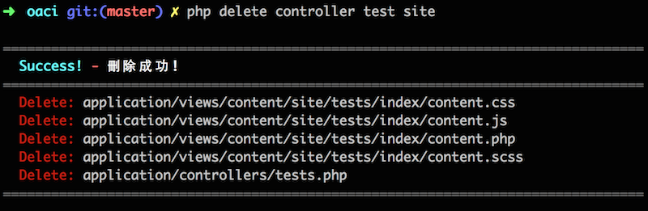

#### delete model
基本指令為 ```php delete model model_name```。

* model_name 為欲刪除的 model 名稱。
* 舉例，若要刪除一個名為 test 的 model，則輸入 ```php delete model test```。
* 特別注意，若是該 model 有引用 OrmImageUploader 的 library，其 third_party 下的相關檔案也會一併移除。

[回常用指令 ↩](#常用指令)

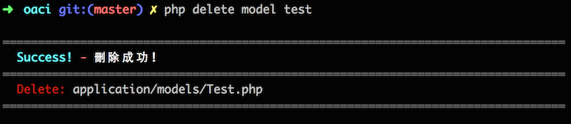

#### delete cell
基本指令為 ```php delete cell cell_name```。

* cell_name 為欲刪除的 cell 名稱。
* 舉例，若要刪除一個名為 test 的 cell，則輸入 ```php delete cell test```。

[回常用指令 ↩](#常用指令)

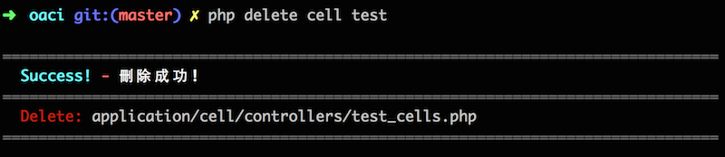

#### migration
基本指令為 ```php migration```。

* 預設會執行到最新的 migration。
* [0 | 1 | 2 |...] 為指定版本，若是沒有此參數，則**預設值為最新版本**。
* 舉例，若要更新 migration，則輸入 ```php migration```，若是要降版至第 0 版，則輸入 ```php migration 0```。

[回常用指令 ↩](#常用指令)

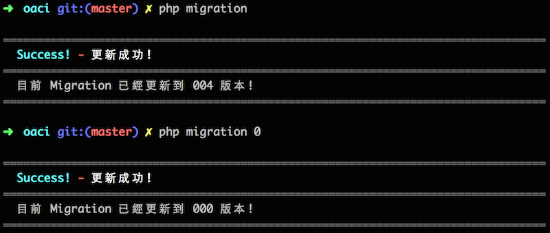


#### clean cache
基本指令為 ```php clean cache [cell | file | model | [assets | static]]```。

* 預設會執行清除所有 cache，指令只要```php clean cache```。
* [cell | file | model | [assets | static]] 參數則代表分別要細清除的項目。

[回常用指令 ↩](#常用指令)

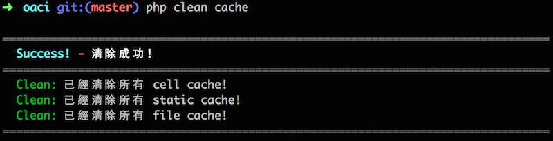

<br />
<br />
### 初始化指令
在一開始建立時會使用到，主要就是處理一些暫存資料夾、資料庫設定檔案..等設定，基本指令為 ```php init [root [password [table [127.0.0.1]]]]```。

* root 為資料庫的 username，**預設值為 root**。
* password 為資料庫的 password，**預設值為 password**。
* table 為資料庫的 table，**預設值為 table**。
* 舉例，若是初始化給予資料庫使用者為 oa，密碼為 1234，資料庫為 oaci，則輸入 ```php init oa 1234 oaci```。

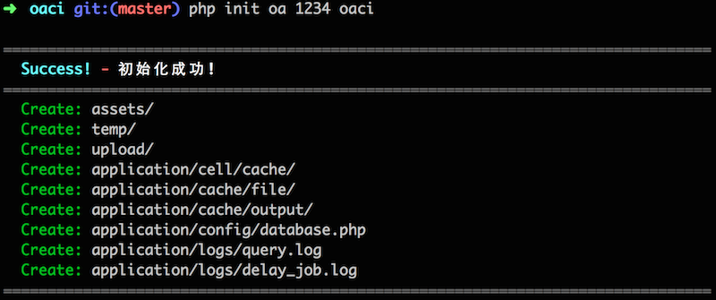

<br />
<br />
### Demo指令
* 此版本也內建 Demo 版本指令，只要一個指令，就可以快速建制一個 CRUD 的版本 Sample!

	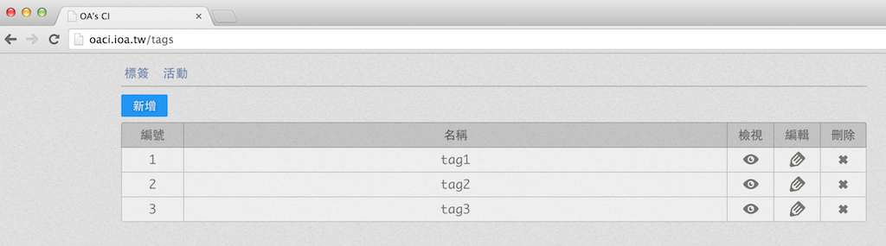

	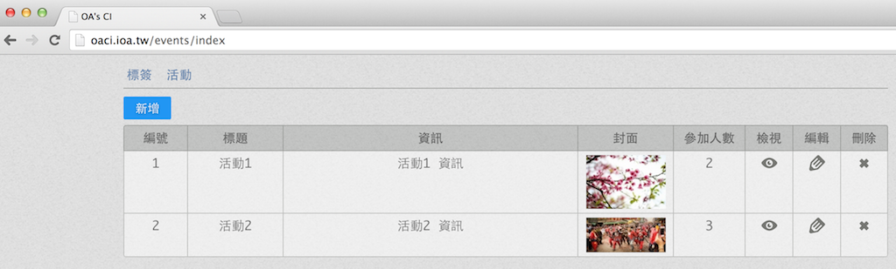 

	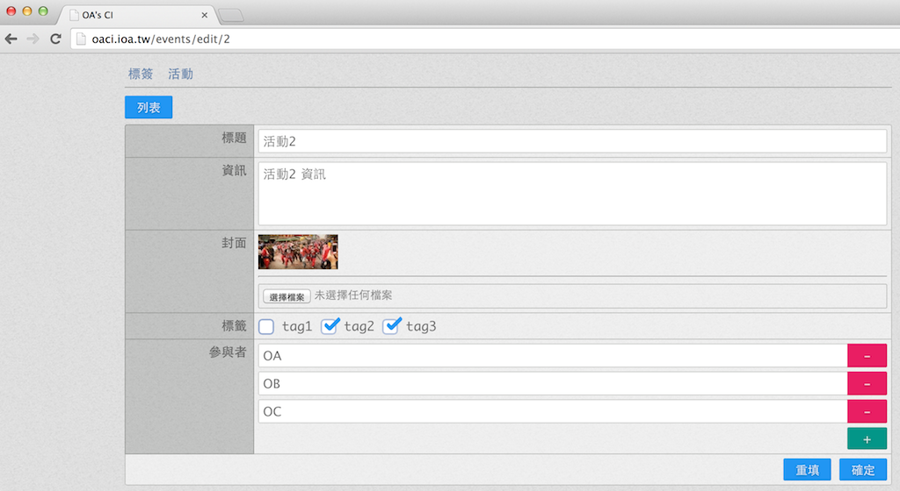 

* 其主要是分別會建立起 event、attendee、tag、tag_event_map 這四張關係表，借由這四張表去演練相關 model、 controller 範例

* 初步創建完後，migration 會自動更新，所以不必特地去執行 migration 指令。

* Demo 指令分別如下:
	* [create demo](#create-demo)。
	* [delete demo](#delete-demo)。

#### create demo
基本指令為 ```php create demo```。

* 主要分別會建立起以下檔案:
	* migrations
		* event
		* attendee
		* tag
		* tag_event_map
	* models
		* Event
		* Attendee
		* Tag
		* TagEventMap
	* cells
		* demo_cells
	* controllers
		* events
		* tags

[Demo指令 ↩](#demo指令)

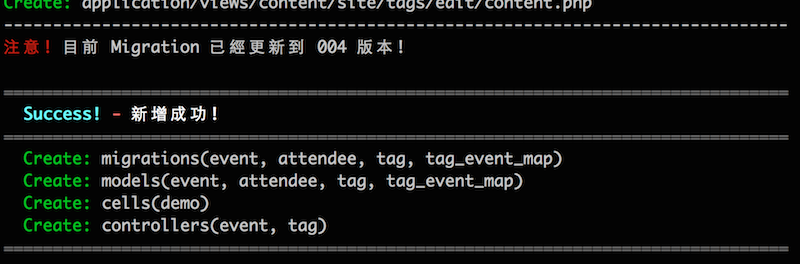

#### delete demo
基本指令為 ```php delete demo```。

* 主要分別會刪除以下檔案:
	* models
		* Event
		* Attendee
		* Tag
		* TagEventMap
	* cells
		* demo_cells
	* controllers
		* events
		* tags
* 特別注意! migrations 不會刪除，所以可能要特別注意一下！

[Demo指令 ↩](#demo指令)

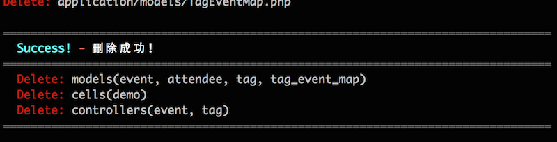


<br />
<br />
### Gulp
* [gulp](http://gulpjs.com/) 是一套可以運用一些別人寫好的套件工具，跟 [grunt](http://gruntjs.com/) 相似，相關簡介可以參考[此篇](http://fireqqtw.logdown.com/posts/249086-good-helper-of-gulp-automation)。
* 資料夾目錄在 ```command/gulp/```，使用前請記得移到該目錄並且下 ```npm install .``` 指令初始。
* 預設 **package.json** 內已初步加入 **gulp**、**gulp-notify**、**gulp-livereload** 三個 module。
* 使用 gulp 可搭配使用 **livereload** 以便於開發。
* 目前預設監聽檔案類型是 css、js、html、php。

<br />
<br />
### Compass
* [compass](http://compass-style.org/) 是一套可以編輯 sass、scss 的編輯工具，可以加快切板速度並且編譯出較優異的 css。
* 資料夾目錄在 ```command/compass/```，使用前請記得移到該目錄並且下 ```compass watch``` 即可開始。
* 所有有關於 compass 的設定可在 ```command/compass/config.rb``` 內設定。

<br />
<br />
<br />

---

<a name="comment1"></a>註1: OrmImageUploader 主要參考於 Ruby on Rails 的 [carrierwave](https://github.com/carrierwaveuploader/carrierwave)所設計。 [↩](#back1)

<a name="comment2"></a>註2: Cell 主要參考於 Ruby on Rails 的 [cells](https://github.com/apotonick/cells) 所設計。 [↩](#back2)

<a name="comment3"></a>註3: DocumentRoot 是指 web 的資料夾位置，一般 Mac OSX 系統下的 apache 預設值為 ```/Library/WebServer/Documents/```。 [↩](#back3)
